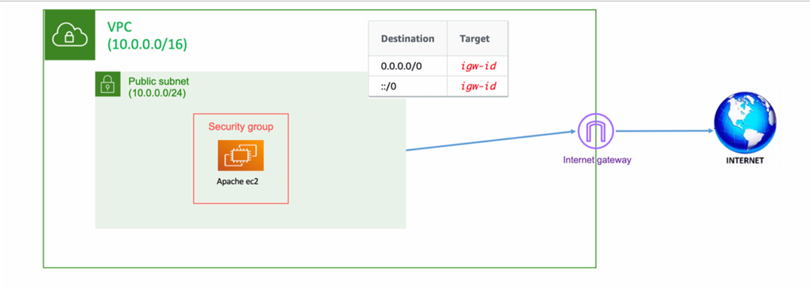

# 🌐 AWS VPC with Public Subnet and EC2 using Terraform


This project provisions a basic AWS infrastructure using Terraform:

- A **VPC**
- A **Public Subnet**
- An **Internet Gateway**
- A **Route Table** with internet access
- A **Security Group** allowing HTTP
- A **Public EC2 Instance** with Apache installed and running

---


## 🔧 Prerequisites
- **Terraform**: [Install Terraform](https://www.terraform.io/downloads)
- **AWS CLI**: [Install AWS CLI](https://docs.aws.amazon.com/cli/latest/userguide/getting-started-install.html)
- **AWS Credentials**: Configure the CLI with:
  ```bash
  aws configure


#### 🚀 Usage

1. **Initialize Backend**
   ```bash
   terraform init

2. **Terraform plan**
   ```bash
   terraform plan   


3. **Terraform apply**
   ```bash
   terraform apply 


3. **Terraform CleanUp**
   ```bash
   terraform destroy